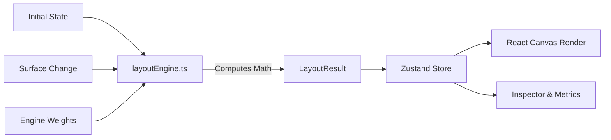

# FLUX — Intelligent Creative Layout Engine

FLUX is an advanced, deterministic layout engine for multi-surface interactive creative content. It treats UI layouts not as static CSS, but as a constraint-satisfaction problem solved in real-time.

---

## 📖 Developer Context: The Problem Space

Adapting interactive ad creatives or dynamic UI components across wildly varying display surfaces (e.g., Desktop 16:9, Mobile 9:16, Square 1:1) is notoriously difficult. 

Standard approaches fall short:
- **CSS Media Queries** are declarative and cannot mathematically evaluate if a "Call to Action" is overlapping with a user's focal point. 
- **Absolute Positioning** breaks the moment the container size changes by a few pixels.
- **Auto-layout (Flexbox/Grid)** doesn't inherently understand visual hierarchy (e.g. deciding to hide a decorative element to preserve a CTA's interactive target size).

**The Solution:** FLUX implements a real-time, algorithmic constraint resolution engine. It evaluates element priorities, minimum dimensions, collision spaces, and safe zones on the fly. 

---

## 🏗️ Core Architecture & Data Flow

FLUX is deliberately architected to decouple the **computation** of the layout from the **rendering** of the layout. 



### Directory Structure

```text
src/
├── engine/                # 🧠 The Brain: Pure-function layout logic (0% React)
│   ├── layoutEngine.ts    # Main constraint resolver sequence
│   ├── collision.ts       # AABB collision detection & spatial resolution
│   ├── scoring.ts         # Heuristic layout health evaluation (0-100)
│   └── types.ts           # Strict data models (CreativeElement, LayoutResult)
├── store/                 # 💾 The Memory: Global Zustand state
│   └── store.ts           # Bridges the pure engine and React UI
└── components/            # 🎨 The Paint: React UI layer
    ├── Editor.tsx         # Main creative workspace framework
    ├── Canvas.tsx         # Render engine outputs with Framer Motion
    ├── Inspector.tsx      # Diagnostic tools & Decision Traces
    ├── EngineLab.tsx      # Constraint weight tuning environment
    └── StressTest.tsx     # Automated headless testing suite
```

---

## ⚙️ How the Layout Engine Works

The core of the application lives in `src/engine/layoutEngine.ts`. The layout calculation is executed synchronously in a strict sequence whenever the surface constraints change:

1. **Priority Sorting**: Elements are processed from highest-priority (e.g., CTA, Product) to lowest (e.g., Decorative).
2. **Dimension Constraints**: Evaluates if the surface width has shrunk below an element's size. If the element possesses the `shrink` behavior, its dimensions are proportionally reduced down to its `minWidth`/`minHeight`.
3. **Repositioning & Safe Zones**: 
   - **Mobile:** Elements are forced into a logical vertical stack based on semantic order, ignoring their desktop absolute coordinates.
   - **Desktop:** Elements flow according to their `preferredZones` and are constrained firmly within mathematically defined `SAFE_ZONE_PADDING`.
4. **Collision Resolution**: Uses strict Axis-Aligned Bounding Box (AABB) intersection testing. Overlaps trigger the lower-priority element to shift position (`reposition`) or disappear entirely (`hide`).
5. **Scoring Formulation**: A heuristic score (0-100) is generated based on how many constraint weights (defined in the `EngineLab`) were violated.

### The Decision Trace System

Because algorithmic layouts can feel like "magic box" behavior, FLUX implements a **Decision Trace**. Every time the `layoutEngine.ts` modifies an element's spatial properties, it pushes a log to the element's trace. Developers can click an element in the Inspector to see exactly *why* it moved:
> *01 — Available width decreased -> SHRINK to 300x150*
> *02 — Unresolvable collision with Headline -> HIDE*

---

## 🚀 Quick Start for Developers

**1. Install & Run**
```bash
npm install
npm run dev
```

**2. Where to start modifying?**
- **To add new elements:** Edit `DEMO_ELEMENTS` inside `src/store/store.ts`.
- **To tweak engine math:** Open `src/engine/layoutEngine.ts` and adjust the sequence inside `calculateLayout()`.
- **To modify visual rendering:** Open `src/components/Canvas.tsx`.

---

## 🧪 Testing with the Stress Test Module

The application includes an internal **Stress Test** screen. 
Instead of rendering DOM nodes, this module passes 8 distinct device viewports directly through the `calculateLayout()` pure function in a rapid loop. This allows developers to statistically verify if a change to the engine logic broke the layout heuristic on edge-case viewports, completing hundreds of complex verifications in under a second.

---

## ⚡ Performance Optimization Choices

Building a layout engine in JavaScript for the browser demands strict performance boundaries:
- **No DOM Measurement:** The engine uses pure math. It never calls `.getBoundingClientRect()` during the layout pass, avoiding costly browser reflows/layouts.
- **Atomic State:** Zustand is used with selectors to prevent global React tree re-renders when single variables change.
- **GPU Acceleration:** `Canvas.tsx` leverages CSS transforms (via Framer Motion) to animate elements to their new calculated coordinates, running on the compositor thread.

---

## 🤖 Why Deterministic Rules Instead of Generative AI?

While Generative AI is excellent for asset creation, real-time spatial layout rendering inside a client browser requires:
1. **Sub-millisecond execution speeds**
2. **Zero layout jitter** (determinism)
3. **Low computational overhead**

LLMs and ML models are currently too slow and non-deterministic for real-time DOM layout recalculation. FLUX demonstrates a robust algorithmic heuristic foundation. 

*Future integration path:* Machine learning models could be used to dynamically adjust the **Penalty Weights** (found in the Engine Lab) on the server side based on historical conversion metrics, feeding those parameters into this deterministic frontend engine.

---

## 🏢 Relevance to Modern Creative Tech

FLUX models the exact frontend infrastructure necessary for companies scaling generative, 3D, or heavily interactive assets. By decoupling the *semantic creative content* from the *surface device constraints*, engineering teams can deploy ad campaigns anywhere without manual designer intervention per format.
